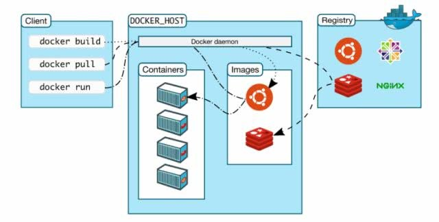
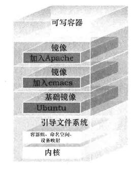
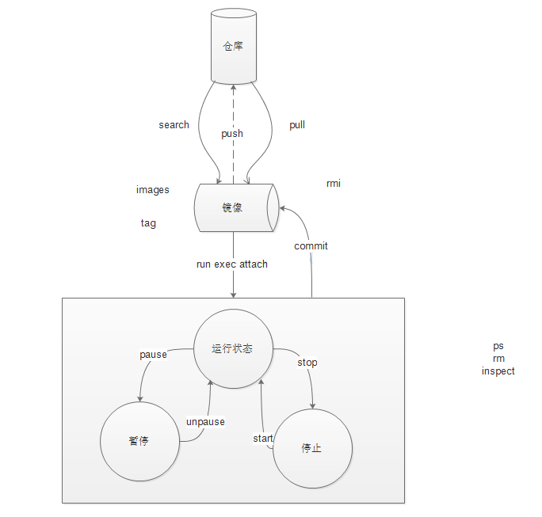
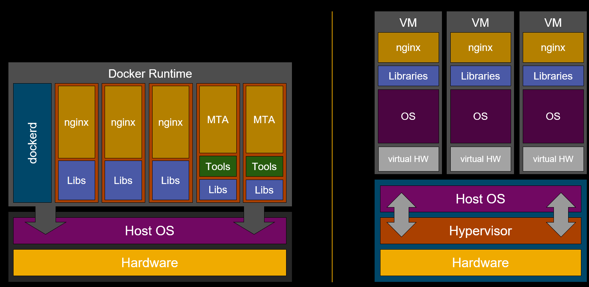

# Docker introduction
* Docker 是一个开源的应用容器引擎, 最初是 dotCloud 公司创始人 Solomon Hykes 在法国期间发起的一个公司内部项目，它是基于 dotCloud 公司多年云服务技术的一次革新，并于 2013 年 3 月以 Apache 2.0 授权协议开源，主要项目代码在 GitHub 上进行维护。Docker 项目后来还加入了 Linux 基金会，并成立推动 开放容器联盟（OCI）
  
* Docker 使用 Google 公司推出的 Go 语言 进行开发实现，基于 Linux 内核的 cgroup，namespace，以及 AUFS 类的 Union FS 等技术，对进程进行封装隔离，属于操作系统层面的虚拟化技术。由于隔离的进程独立于宿主和其它的隔离的进程，因此也称其为容器。最初实现是基于 LXC，从 0.7 版本以后开始去除 LXC，转而使用自行开发的 libcontainer，从 1.11 开始，则进一步演进为使用 runC 和 containerd.
  
* Docker 的使用场景: 
  * 创建一致的开发、测试、生产环境；
  * 创建资源隔离的运行时环境；
  * 云平台的基础设施之一；
  * 高性能、超大规模宿主机部署；
* Docker 是一个开源的商业产品，有两个版本：社区版（Community Edition，缩写为 CE）和企业版（Enterprise Edition，缩写为 EE）。企业版包含了一些收费服务，个人开发者一般用不到。下面的介绍都针对社区版。

# Docker architecture

## Docker Engine
Docker使用了传统的Client-Server架构

Docker 客户端(Client) : 通过命令行或者其他工具使用 [Docker API](https://docs.docker.com/reference/api/docker_remote_api) 与 Docker 的守护进程通信。

Docker API: 负责提供client与docker daemon交互的接口。

Docker daemon: Docker最核心的后台进程,一般运行在宿主机之上，负责响应来自Docker client的请求，根据请求类型创建出指定的Job，完成构建、分发和运行Docker容器的工作


一般的总架构下图所示:



用户通过Docker client与Docker daemon通过API建立通信。daemon响应来自Docker client的请求，根据请求类型做出相应的行为。

Docker技术使用Docker镜像来创建实例容器。镜像可以从远程的仓库拉取，用户也可以上传镜像到仓库中

Docker 镜像(Image): 用于创建 Docker 容器的模板。

Docker 容器(Container) : 独立运行的一个或一组应用。

Docker 主机(Host): 一个物理或者虚拟的机器用于执行 Docker 守护进程和容器。

Docker 仓库(Registry): 用来保存镜像，可以理解为代码控制中的代码仓库。[Docker Hub](https://hub.docker.com) 提供了庞大的镜像集合供使用。

## Docker image
Docker镜像（Image）

Docker 镜像是一个特殊的文件系统，除了提供容器运行时所需的程序、库、资源、配置等文件外，还包含了一些为运行时准备的一些配置参数（如匿名卷、环境变量、用户等）。

Docker镜像的文件系统最底端是一个文件引导系统，Docker用户不会与引导文件系统有直接的交互。Docker镜像的第二层是root文件系统rootfs，通常是一种或多种操作系统，例如ubuntu等。在Docker中，文件系统永远都是只读的，在每次修改时，都是进行拷贝叠加从而形成最终的文件系统。Docker称这样的文件为镜像。一个镜像可以迭代在另一个镜像的顶部。位于下方的镜像称之为父镜像，最底层的镜像称之为基础镜像。最后，当从一个镜像启动容器时，Docker会在最顶层加载一个读写文件系统作为容器存储层。

镜像是不会改变的, 如果文件系统需要发生改变, 变化会应用到最顶层, 也就是读写系统的容器.这种机制也被称为写时复制( copy on write).



简单的说, Docker镜像可以认为是容器的模板, 它包含容器所要运行时所需的程序、库、资源以及相关配置。镜像不包含任何动态数据，其内容在构建之后不会被改变。一个运行着的Docker容器是一个镜像的实例，多个容器可以共用一个镜像。
### Image commands
镜像常见的命令：
1. ```docker images``` 用于列出当前docker 主机上的可用镜像. ```docker image list``` or ```docker image ls```也可以有同样的效果
2. ```docker search``` 查看仓库里的镜像
3. ```docker pull``` 拉取镜像
   试试命令```docker pull alpine```  
   他实际上是执行了 ```docker pull registry.hub.docker.com/alpine:latest```  
   可以通过tag来限定版本
4. ```docker rmi``` 删除镜像
5. ```docker image prune``` 删除unused镜像
6. ```docker push```  把镜像提交到仓库
7. ```docker inspect``` 查看详细信息
   ```docker inspect -f '{{.ContainerConfig.Hostname}}' $(docker images -aq)``` Go语言的模板语法可以用于某些命令  
   ```docker inspect -f '{{.LogPath}}' $(docker ps -aq)```

## Docker container
容器（Container）

镜像（Image）和容器（Container）的关系，就像是面向对象程序设计中的 类 和 实例 一样，镜像是静态的定义，容器是镜像运行时的实体。容器可以被创建、启动、停止、删除、暂停等。

容器的实质是进程，但与直接在宿主执行的进程不同，容器进程运行于属于自己的独立的 命名空间。因此容器可以拥有自己的 root 文件系统、自己的网络配置、自己的进程空间，甚至自己的用户 ID 空间。容器内的进程是运行在一个隔离的环境里，使用起来，就好像是在一个独立于宿主的系统下操作一样。这种特性使得容器封装的应用比直接在宿主运行更加安全。

前面讲过镜像使用的是分层存储，容器也是如此。每一个容器运行时，是以镜像为基础层，在其上创建一个当前容器的存储层，它是一个可写层（writable layer,也称为容器层 container layer），它位于若干只读层之上。运行时的所有变化，包括对文件的写和更新，都会保存在这个层中。

容器不应该向其存储层内写入任何数据，容器存储层要保持无状态化。所有的文件写入操作，都应该使用 数据卷（Volume）、或者绑定宿主目录，在这些位置的读写会跳过容器存储层，直接对宿主（或网络存储）发生读写，其性能和稳定性更高。

数据卷的生存周期独立于容器，容器消亡，数据卷不会消亡。因此，使用数据卷后，容器删除或者重新运行之后，数据却不会丢失。
### container commands

1. ```docker run``` 运行容器  
   ```docker run -ti --name my_container --restart=on-failure:1 alpine /bin/sh -c "while true; do echo hello world; sleep 1; done"``` 使用镜像运行一个容器  
   ```-d ``` 后台运行  
   ```-p -P``` 指定端口
   ```-v``` 使用持久化的存储  

    当利用 docker run 来创建容器时，Docker 在后台运行的标准操作包括：

     - 检查本地是否存在指定的镜像，不存在就从公有仓库下载  
     - 利用镜像创建并启动一个容器  
     - 分配一个文件系统，并在只读的镜像层外面挂载一层可读写层  
     - 从宿主主机配置的网桥接口中桥接一个虚拟接口到容器中去  
     - 从地址池配置一个 ip 地址给容器  
     - 执行用户指定的应用程序  
     - 执行完毕后容器被终止  
2. ```docker ps``` 查看所有的容器 和 ```docker container ls```同效  
3. ```docker attach``` 重新附着容器  
4. ```docker exec``` 在容器内容启动新进程  
5. 生命周期管理， 暂停，恢复，停止，启动 pause, unpause, stop, start
6. ```docker logs``` 查看log  
7. ```docker inspect``` 检查某个具体的容器
8. ```docker rm``` 删除容器
9. ```docker commit```，对容器做了修改后，把改动后的容器，再次转换为镜像
10. docker rm `docker ps -a -q` -f 删除所有容器
    
## Docker repository 
仓库（Repository）

仓库是集中存放镜像文件的场所，每个仓库中可包含多个具备不同标签的镜像。仓库类似于Git工具，当用户创建自己的镜像后可以上传到公有或私有的仓库，当需要使用时，从仓库下载过来即可。

[Docker Hub](https://hub.docker.com) 

[IBM CIO repository](https://pages.github.ibm.com/CIOCloud/cio-blog/#/artifactory/?id=building-and-pushing-image)
# Docker practice

## Build your own image
### Docker commit  
  ```docker commit -m "commit test" container-id image-name:tag```  
  不推荐使用这种方式, 因为难以复用, 不能很好的和其它方式兼容;
  
### Docker build & Dockerfile
Dockerfile是Docker用来构建镜像的脚本文件，包含自定义的指令和格式。用户可以用统一的语法命令来根据需求进行配置，在不同的平台上进行分发，简化开发人员构建镜像的复杂过程。  

#### Dockerfile commands
* COPY 复制文件  
  COPY [--chown=<user>:<group>] <源路径>... <目标路径>  
  COPY [--chown=<user>:<group>] ["<源路径1>",... "<目标路径>"]
* CMD 容器启动命令  
  shell 格式：CMD <命令>  
  exec 格式：CMD ["可执行文件", "参数1", "参数2"...]  
  参数列表格式：CMD ["参数1", "参数2"...]。在指定了 ENTRYPOINT 指令后，用 CMD 指定具体的参数。
  CMD的命令会被run 的执行cmd命令默认覆盖
* ENTRYPOINT 入口点
  当存在 ENTRYPOINT 后，执行时的CMD 的内容将会作为参数传给 ENTRYPOINT
* ENV 设置环境变量
* EXPOSE 暴露端口
* WORKDIR 指定工作目录
* USER 指定当前用户

#### Practic
1. 通过```docker pull ubuntu``` 获取最新版本的ubuntu官方镜像
2. 以这个镜像为基础, 通过Dockerfile build自己的镜像   
```docker build -t ubuntu:nginx -f ./Dockerfile01 .```   

## Start your container
```docker run -d -p 80 --name nginx_test ubuntu:nginx```   
```docker port``` 查看宿主分配的端口

## Interact with your container
```docker exec```  
```docker logs```

# Other Topic

## Docker network
当 Docker 启动时，会自动在主机上创建一个 docker0 虚拟网桥，实际上是 Linux 的一个 bridge，可以理解为一个软件交换机。它会在挂载到它的网口之间进行转发.

同时，Docker 随机分配一个本地未占用的私有网段（在 RFC1918 中定义）中的一个地址给 docker0 接口。比如典型的 172.17.42.1，掩码为 255.255.0.0。此后启动的容器内的网口也会自动分配一个同一网段（172.17.0.0/16）的地址。在Windows 平台分配会有不同

当创建一个 Docker 容器的时候，同时会创建了一对 veth pair 接口（当数据包发送到一个接口时，另外一个接口也可以收到相同的数据包）。这对接口一端在容器内，即 eth0；另一端在本地并被挂载到 docker0 网桥，名称以 veth 开头（例如 vethAQI2QT）。通过这种方式，主机可以跟容器通信，容器之间也可以相互通信。Docker 就创建了在主机和所有容器之间一个虚拟共享网络。


### Docker Networking
用于容器相互之间通信
```docker network create testnet```
```docker network ls```  
通过 ```docker run --net=testnet```将容器指定到某一网络

```--link``` 1.9版本之前的推荐

## Other docker command
* ```docker top```
* ```docker stats```
* ```docker system```
* ```docker info```

## Compare with VM

虚拟机和Docker都能够给一台宿主机上的应用提供隔离的运行环境。区别是什么呢？

传统的虚拟机通过在宿主主机中运行 hypervisor 来模拟一整套完整的硬件环境提供给虚拟机的操作系统。虚拟机系统看到的环境是可限制的，也是彼此隔离的。 这种直接的做法实现了对资源最完整的封装，但很多时候往往意味着系统资源的浪费。 例如，以宿主机和虚拟机系统都为 Linux 系统为例，虚拟机中运行的应用其实可以利用宿主机系统中的运行环境。

实际上在操作系统中，包括内核、文件系统、网络、PID、UID、IPC、内存、硬盘、CPU 等等，所有的资源都是应用进程直接共享的。 要想实现虚拟化，除了要实现对内存、CPU、网络IO、硬盘IO、存储空间等的限制外，还要实现文件系统、网络、PID、UID、IPC等等的相互隔离。 前者相对容易实现一些，后者则需要宿主机系统的深入支持。

随着 Linux 系统对于命名空间功能的完善实现，程序员已经可以实现上面的所有需求，让某些进程在彼此隔离的命名空间中运行。大家虽然都共用一个内核和某些运行时环境（例如一些系统命令和系统库），但是彼此却看不到，都以为系统中只有自己的存在。这种机制就是容器（Container），利用命名空间来做权限的隔离控制，利用 cgroups 来做资源分配



从上图右边虚拟机架构图能看出，虚拟机里在宿主操作系统和物理硬件之间多了一个中间层：Hypervisor。

Hypervisor是一种运行在物理服务器和操作系统之间的中间软件层，可允许多个操作系统和应用共享一套基础物理硬件，事实上成为虚拟环境中的“元”操作系统，Hypervisor可以协调访问服务器上的所有物理设备和虚拟机，也称为虚拟机监视器（Virtual Machine Monitor）。Hypervisor是所有虚拟化技术的核心。当服务器启动并执行Hypervisor时，它会给每一台虚拟机分配适量的内存、CPU、网络和磁盘，并加载所有虚拟机的客户操作系统，每台虚拟机有自己的虚拟操作系统和存储空间，因此需要消耗宿主机大量的物理资源，同时也需要花费一定时间来启动。

而上图左边，Docker直接运行在宿主机的操作系统上，没有Hypervisor这个中间层。Docker实际上就是运行于操作系统上的普通进程，通过Linux Primitives实现的彼此隔离，但是共享同一个操作系统内核。

正因为这种共享性，使得Docker的资源占用远小于虚拟机，而且启动速度也远远快于虚拟机